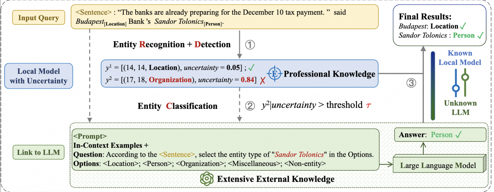

<div align="center">

</div>

# LinkNER: Linking Local Named Entity Recognition Models to Large Language Models using Uncertainty

[](https://pytorch.org/)[](https://arxiv.org/abs/2402.10573)

Repo for [*LinkNER: Linking Local Named Entity Recognition Models to Large Language Models using Uncertainty*](https://dl.acm.org/doi/10.1145/3589334.3645414)


# Demo Version
We provide a demo version of the code for easy copying.

## Supported Models
Currently, the LLM supports Llama, Qwen, and GPT series. Additional models can be added as needed.

## Installation
Run the following command to install the required dependencies:

```bash
pip install -r requirement.txt
```

# 🚀 Quick Start
We offer the following scripts to facilitate training and inference. The parameters that need to be modified are represented as placeholders in the scripts.

## Step 1: Train Local Models
### Train Spanner
To train the Spanner model, execute:
```bash
bash scripts/spanner_train.sh
```
### Train E-NER
To train the E-NER model, execute:
```bash
bash scripts/ener_train.sh
```

## Step 2: Link to LLM
After obtaining the checkpoint from Step 1, run the following script for inference and save the results:
```bash
bash scripts/local_inference.sh
```

Use the LLM to refine uncertainty data that exceeds the specified threshold:
```bash
bash scripts/llm_inference.sh
```

### Note
You can also choose to have local processing and LLM inference work together for each piece of data by including LLM calls during inference.

## Dataset
The download links for the datasets used in this work are as follows:
- [CoNLL-2003](https://www.clips.uantwerpen.be/conll2003/ner/)
- [CONLL-2023-Typos & OOV](https://github.com/BeyonderXX/MINER)
- [TwitterNER](https://github.com/BeyonderXX/MINER)
- [OntoNotes 5.0](https://catalog.ldc.upenn.edu/LDC2013T19)
- [WNUT-2016](http://noisy-text.github.io/2016/ner-shared-task.html)
- [WNUT-2017](http://noisy-text.github.io/2017/emerging-rare-entities.html)

We also provide several training and test sets based on CoNLL 2003 in the `data/` directory.

## Prepare Models
For E-NER, we utilize [BERT-base](https://huggingface.co/bert-base-uncased), [BERT-large](https://huggingface.co/google-bert/bert-large-uncased)

## API_BASE
We use the OpenAI API, specifically [gpt-3.5-turbo](https://platform.openai.com/docs/models/gpt-3-5).

For Llama 3, we utilize [Llama-3-8b-it](https://huggingface.co/meta-llama/Meta-Llama-3-8B/tree/main).

For Qwen 2.5, we utilize [Qwen/Qwen2.5-7B-Instruct](https://huggingface.co/Qwen/Qwen2.5-7B-Instruct).

# 🌟 Acknowledgement

When citing our work, please kindly consider citing the original papers. The relevant citation information is listed here.

```bigquery
@inproceedings{10.1145/3589334.3645414,
author = {Zhang, Zhen and Zhao, Yuhua and Gao, Hang and Hu, Mengting},
title = {LinkNER: Linking Local Named Entity Recognition Models to Large Language Models using Uncertainty},
year = {2024},
isbn = {9798400701719},
publisher = {Association for Computing Machinery},
address = {New York, NY, USA},
url = {https://doi.org/10.1145/3589334.3645414},
doi = {10.1145/3589334.3645414},
abstract = {},
booktitle = {Proceedings of the ACM Web Conference 2024},
pages = {4047–4058},
numpages = {12},
keywords = {information extraction, large language models, robustness, uncertainty estimation},
location = {Singapore, Singapore},
series = {WWW '24}
}
```

